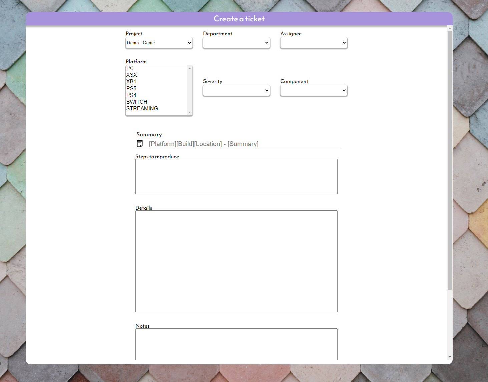

# Manette
## Final Project for Concordia Bootcamp by Jeffrey Kingsbury

Manette is a bug tracking application designed for the quality assurance domain.


#
### Getting started:

##### __* * *Please note this will require two terminals to function properly.*__

## Starting the server:
* Open a new terminal.
* Navigate to the server folder with ```cd server``` from the root.
* Install the dependencies with ```yarn install``` or ```npm install```.
* Start the server with ```yarn dev```.

## Starting the client:
* Open a new terminal. (Ensure the server remains running)
* Navigate to the client folder with ```cd client``` from the root.
* Install the dependencies with ```yarn install``` or ```npm install```.
* Start the server with ```yarn dev```.

#
## Features:
* Create tickets 
* Edit tickets, add / remove attachments
* Upload media (Images / video / .dmp / txt) 
* Assign tickets
* Create user roles with different permissions
* Login / logout
* SHOUT feature that shows a message to all users in the activity feed
* Recover passwords via email
* Progress tracking and analytics
* Exporting individual ticket data to CSV
* Custom severities 
* Custom componenets (ex: UI/UX, Frontend, Backend) when creating tickets

#
# Tech used:
#### Frontend
* React
* React styled componenets
* React icons
* Images from Unsplash

#### Backend
* Express
* Bcrypt
* Body-parser
* Cookie-Parser
* Multer
* NodemMailer
* UUID
* JsonWebToken

#
### Images
## Login Screen


#
## Forgot password modal


#
## Dashboard


#
## Ticket Creation


